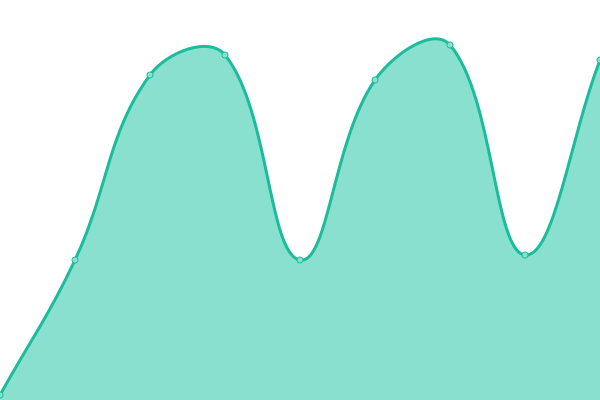

# [📈 Live Status](https://farhun1.github.io/upptime-pscore): <!--live status--> **🟧 Partial outage**

This repository contains the open-source uptime monitor and status page for [Farhun](farhun.pages.dev), powered by [Upptime](https://github.com/upptime/upptime).

With [Upptime](https://upptime.js.org), you can get your own unlimited and free uptime monitor and status page, powered entirely by a GitHub repository. We use [Issues](https://github.com/farhun1/upptime-pscore/issues) as incident reports, [Actions](https://github.com/farhun1/upptime-pscore/actions) as uptime monitors, and [Pages](https://farhun1.github.io/upptime-pscore) for the status page.

<!--start: status pages-->
<!-- This summary is generated by Upptime (https://github.com/upptime/upptime) -->
<!-- Do not edit this manually, your changes will be overwritten -->
<!-- prettier-ignore -->
| URL | Status | History | Response Time | Uptime |
| --- | ------ | ------- | ------------- | ------ |
|  [Whatsapp IP (57.144.143.32)](http://57.144.143.32) | 🟥 Down | [whatsapp-ip-57-144-143-32.yml](https://github.com/farhun1/upptime-pscore/commits/HEAD/history/whatsapp-ip-57-144-143-32.yml) | 

 467ms
     
 | 

<a href="https://farhun1.github.io/upptime-pscore/history/whatsapp-ip-57-144-143-32">0.00%</a>
    

|  [Cloudflare DNS Dhaka](http://1.1.1.1) | 🟥 Down | [cloudflare-dns-dhaka.yml](https://github.com/farhun1/upptime-pscore/commits/HEAD/history/cloudflare-dns-dhaka.yml) | 

 0ms
     
 | 

<a href="https://farhun1.github.io/upptime-pscore/history/cloudflare-dns-dhaka">0.00%</a>
    

|  [Wikipedia](wikipedia.org) | 🟥 Down | [wikipedia.yml](https://github.com/farhun1/upptime-pscore/commits/HEAD/history/wikipedia.yml) | 

 204ms
     
 | 

<a href="https://farhun1.github.io/upptime-pscore/history/wikipedia">98.26%</a>
    

|  [DNS Cloudflare](1.1.1.1) | 🟩 Up | [dns-cloudflare.yml](https://github.com/farhun1/upptime-pscore/commits/HEAD/history/dns-cloudflare.yml) | 

 136ms
     
 | 

<a href="https://farhun1.github.io/upptime-pscore/history/dns-cloudflare">100.00%</a>
    

|  [Google DNS 2](8.8.8.8) | 🟥 Down | [google-dns-2.yml](https://github.com/farhun1/upptime-pscore/commits/HEAD/history/google-dns-2.yml) | 

 2ms
     
 | 

<a href="https://farhun1.github.io/upptime-pscore/history/google-dns-2">0.09%</a>
    

|  [Whatsapp IP (57.144.142.141)](57.144.142.141) | 🟥 Down | [whatsapp-ip-57-144-142-141.yml](https://github.com/farhun1/upptime-pscore/commits/HEAD/history/whatsapp-ip-57-144-142-141.yml) | 

 0ms
     
 | 

<a href="https://farhun1.github.io/upptime-pscore/history/whatsapp-ip-57-144-142-141">0.00%</a>
    

|  [Cloudflare DNS](1.1.1.1) | 🟥 Down | [cloudflare-dns.yml](https://github.com/farhun1/upptime-pscore/commits/HEAD/history/cloudflare-dns.yml) | 

 0ms
     
 | 

<a href="https://farhun1.github.io/upptime-pscore/history/cloudflare-dns">0.00%</a>
    

|  [Google](google.com) | 🟥 Down | [google.yml](https://github.com/farhun1/upptime-pscore/commits/HEAD/history/google.yml) | 

 60ms
     
 | 

<a href="https://farhun1.github.io/upptime-pscore/history/google">98.98%</a>
    

|  [IPv6 test](forwardemail.net) | 🟥 Down | [i-pv6-test.yml](https://github.com/farhun1/upptime-pscore/commits/HEAD/history/i-pv6-test.yml) | 

 0ms
     
 | 

<a href="https://farhun1.github.io/upptime-pscore/history/i-pv6-test">100.00%</a>
    

<!--end: status pages-->

[**Visit our status website →**](https://farhun1.github.io/upptime-pscore)

## 📄 License

- Powered by: [Upptime](https://github.com/upptime/upptime)
- Code: [MIT](./LICENSE) © [Anand Chowdhary](https://anandchowdhary.com), supported by [Pabio](https://pabio.com)
- Data in the `./history` directory: [Open Database License](https://opendatacommons.org/licenses/odbl/1-0/)
